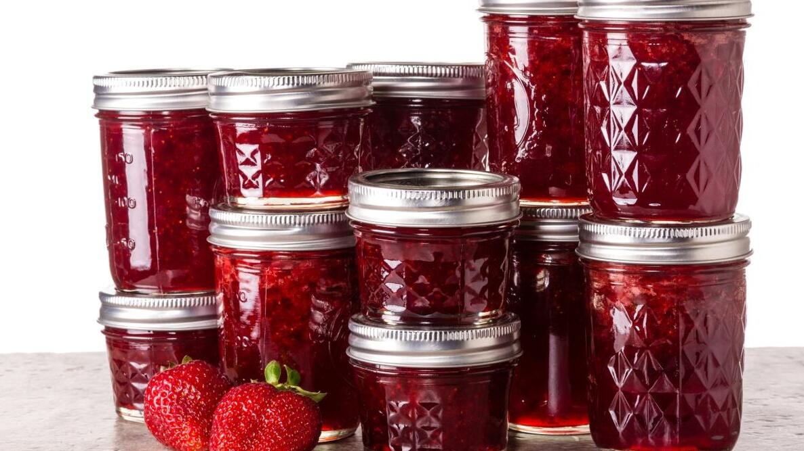

After over a year of attempting off and on to create my own coding blog using JAMstack architecture, dougchu.codes, the very site you are reading right now, is finally online.

But first, what is Jamstack? Despite what you may think, Jamstack has nothing to do with the physical arrangement of multiple jars of fruit preserves. It also has nothing to do with the NBA JAM series of two-on-two arcade basketball games from the early 90's.

*(Both of these are not Jamstack.)*

Jamstack is a kind of architecture for building websites that prioritizes speed and simplicity through splitting the different parts that make a website work. Fun fact\*: much like the SAT, the ACT, or for a brief period, KFC, Jamstack once referred to an acronym that is no longer a part of the word's current definition. The "JAM" part used to refer to "Javascript, APIs, and Markup," which represented that split in the architecture of a website: Javascript to handle the interactive elements of a website, APIs to handle a website's data by communicating with the server back end, and Markup to handle the individual pages in a website.

So what does Jamstack mean today? Well, now, apparently there isn't one exact definition that people agree on anymore. I guess that's the tech world for ya. But people who use Jamstack tend to agree that it should make your website do at least three things:

1. Pre-render its content. Instead of making a call to a server to load a web page when a user clicks a link to it, a dynamic process with a bunch of moving parts, a Jamstack website generates everything in advance as static elements, using something called a static site generator.
2. Decouple its services into different components. Instead of being built in some kind of monolithic, synergistic tandem, a Jamstack website splits its front end and back end into separate parts. This also makes stuff like maintenance and updating things easier, given that your structure is less complex.
3. The back end is simply an API that connects to something else. An API is basically like a map of connections to a collection of data that's stored somewhere else, instead of directly on your website. This modularity is key to Jamstack. It could be a "headless" CMS (content management system) designed to work with any number of static site generators. It could be data you host yourself somewhere. Or some other kind of application for data storage altogether.

OK, so that's Jamstack for you. But how did I choose this exciting wave of the future as the format for my blog, especially when it took me so long to finish? I'm so glad you asked. Well, way back during the waning months of 2020, having just finished software development boot camp, a mentor advised me to start my own blog as part of my portfolio. You know, to have my own website where people that were thinking of having me work for them could read my thoughts on various coding stuff I'd done. Something more personal than a github link or a resume. So, I set off to do just that.

At first I looked into the simplest way possible to set up a blog, so I could start writing as soon as possible and make good time on making myself look desirable to employers. I'm a very online person, so my first thought was, Wordpress! Of course! I even dug up a Wordpress blog that I had created as a college student and never posted once on. I won't link to it because the URL is pretentious and embarrassing! Anyway, the monthly costs of hosting a Wordpress site gave me pause. Potentially paying $20-$30 a month just for a blog seemed a bit much. Like many an infomercial actor, I cried out, "There has to be a better way!"

This impulse to find a cheaper and more compelling solution to my blog question led me to, as it often does, to a familiar place: a Reddit wormhole. Reddit is many things both good and bad, but it's great for pursuing niche interests and hobbies. With some digging around on coding subreddits for ways to make my own blog, I discovered Jamstack. I decided to go with a combination of Digital Ocean for hosting, Ghost for the blogging platform, and Gatsby for the static site generator front end. It was a toss-up between Gatsby and Next.js for the SSG of choice, but I liked Gatsby's documentation better. I'm big on following instructions carefully.

What proceeded next felt like I was snakebit. If you play Dungeons & Dragons, it felt like rolling four natural 1's on a 20-sided die in a row. It was as if every step of the process conspired to not work as it was supposed to in order to build character or something.

First, creating the Digital Ocean droplet turned out to be a security nightmare with my Macbook Pro running Catalina. I took the advice of the Digital Ocean build guides and the coding subreddits and set up SSH token protection so that no one could break into my blog and steal my precious thoughts from me. However, I then proceeded to learn the hard way that MacOS stores internal passwords to access the SSH server in a funky way. Namely, that it doesn't store them in the keychain at all. This took about three frustrating days to realize. I wrote a frustrated note telling myself to not bother with SSH security, best practices be damned, and set it aside for about four months as I took a contract job with a friend's startup.

Four months later, my contract finished, I decided to resume my Sisyphean labors on getting the blog online. Through careful use of my password manager app, I managed to avert any problems from MacOS being finicky about storing my SSH password. Then I ran into another roadblock: I don't remember exactly why, but I had created a Digital Ocean droplet according to the default Ubuntu settings instead of... their 1-click, tailor-made droplet template made specifically for Ghost. Doom. Disaster. Not really. But I was frustrated. The easy thing to do would have been to delete my droplet and create it again, but I was feeling stubborn for some reason and wanted to figure out if I could install Ghost onto the droplet anyway. The long way around, basically.

Thankfully, I was right. The answer ended up being on Ubuntu install guides for installing Ghost onto a Digital Ocean droplet. With MacOS using Linux protocols for its command line interface, all the instructions transferred over directly. I installed Node.js, Nginx, and MySQL onto my SSH server, which I guess the DigitalOcean Ghost droplet would've done automatically. I then installed the ghost-cli framework. Everything was clicking. We were humming on all cylinders. All that was left to do was to type in "ghost start" and my blog would finally thrum to life.
So of course that didn't happen. To my rueful lack of surprise, the final step crashed out with some kind of MySQL password security error. It turns out the blog I was following was written for an older version of MySQL, and subsequent updates had a new password requirement that left the installation totally borked. At that point it was getting late, so I angrily decided to call it a day, stormed off to the gym, and hoped and prayed that a fresh mind the next day would lead me to the solution.

It turns out that my efforts to hunt down and follow Ubuntu install guides for Ghost were not in vain, as the next day I had the idea to see if the official Ghost documentation had instructions on how to deal with the MySQL updates. It turns out, it did! But what's more, I wasn't frustrated that I hadn't found this official documentation earlier. The blog that I followed had much clearer instructions than the official documentation, and there's a good chance I would've messed something up or gotten stuck trying to follow it. With bated breath, I once again punched in "ghost start"... and it worked.

It worked.

It WORKED.

One day, I'd like to write my own Jamstack build guide for this blog. Lord knows I had to work hard to get it running. I'm not ready to that yet, because, frankly, I need a break from Jamstack install guide minutiae. But nonetheless, I did it. I built my own blog.